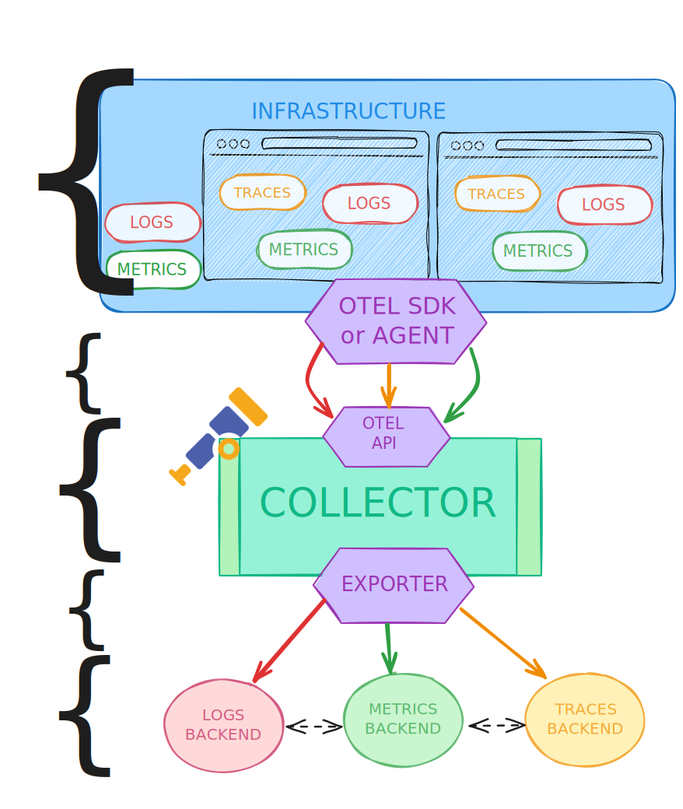

# Architecture
## 1000-feet view

 
 
::left::

- Instrument & collect the _Context_ &nbsp; 
- Transmit&nbsp;
    * OTLP/HTTP (1 or 2)
    * OTLP/gRPC
- Collect & process&nbsp;
    * pipeline as YAML
- Send to Backends&nbsp;
    * !!! vendor-agnostic !!!

::right::

    <v-click>
      <FancyArrow
        x1="500"
        y1="120"
        q2="[data-id=instr]"
        pos2="right"
        color="blue"
      />
    </v-click>

<v-click at="-0">
    <FancyArrow
        x1="520"
        y1="375"
        q2="[data-id=trans]"
        pos2="right"
        color="red"
        arc="-0.2"
    />
    <FancyArrow
        x1="520"
        y1="235"
        q2="[data-id=trans]"
        pos2="right"
        color="red"
        arc="0.009"
    />
</v-click>

    <v-click at="-0">
        <FancyArrow
            x1="518"
            y1="312"
        q2="[data-id=collect]"
        pos2="right"
            color="green"
        />
    </v-click>

<v-click at="-0">
    <FancyArrow
        x1="518"
        y1="452"
        q2="[data-id=export]"
        pos2="right"
        color="yellow"
    />
</v-click>

