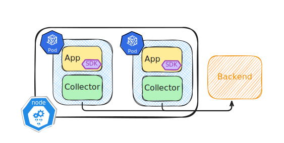
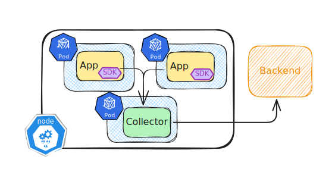
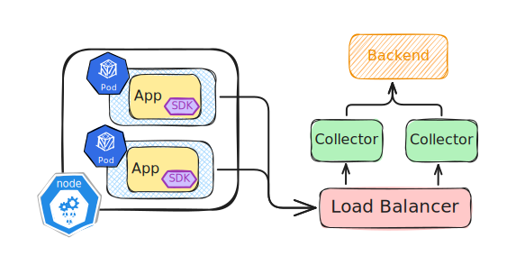

# Collector deploy modes

::left::
<v-click>

### Stand-alone

</v-click>

<v-click>
<h3 style="margin-top:-90px;">Agent</h3>

</v-click>

::right::

<v-click>
<h3 style="margin-top: -80px;">Sidecar</h3>

</v-click>
<v-click>

### Node

</v-click>
<v-click>

### Service

</v-click>

