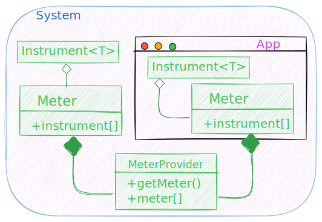

 

# Instrumenting: the Metrics SDK

::left::

 

- The _Intrument_ crunchs the numbers
- The _Meter_ gathers:
    * Instruments
    * _View_ can aggregate data
- The Provider controls and returns
    * the defined metrics
    * the behaviour overall

::right::

</img>

